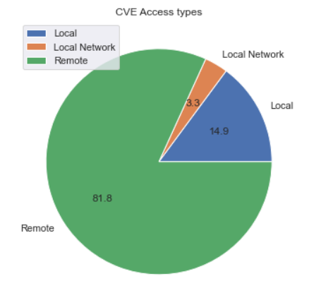
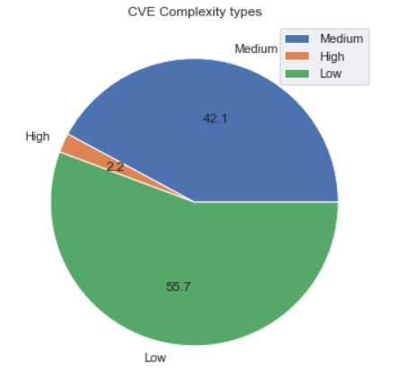
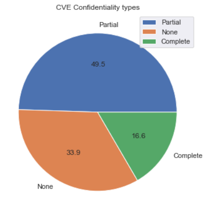
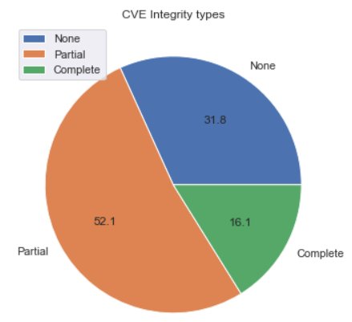
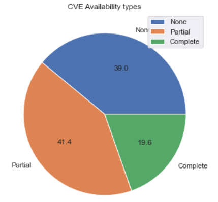
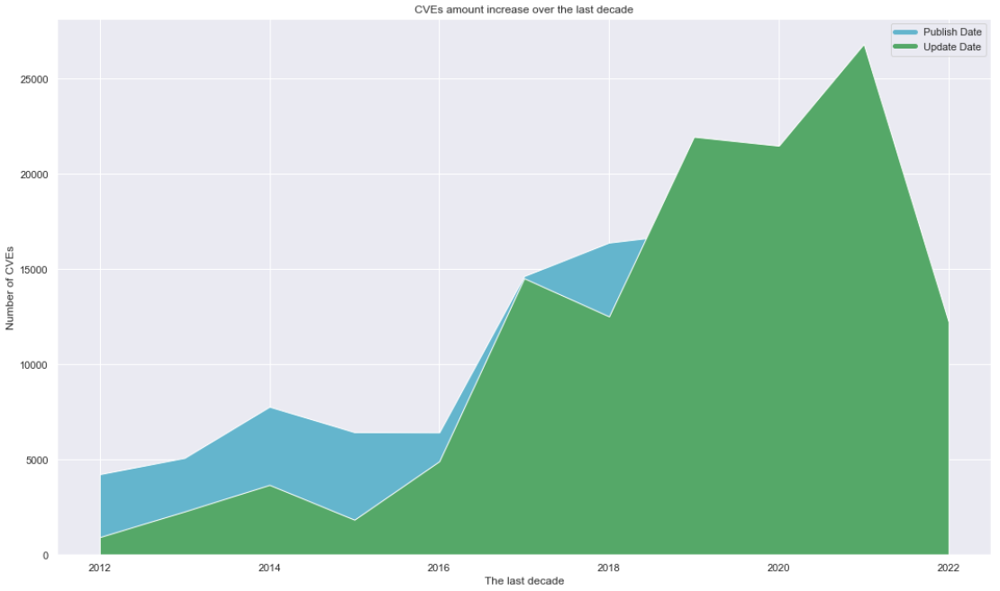
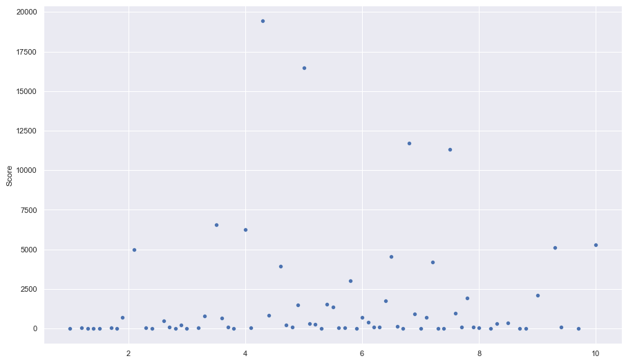
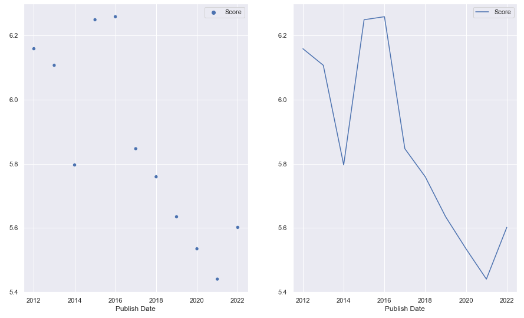

# Data Science Project | Common Vulnerability Exposures 

## Phase 1 - Project introduction

**Submitted by:**

* Einav Pincu
* Idan Buller

CVE, short for Common Vulnerabilities and Exposures, is a list of publicly disclosed computer security vulnerabilities and flaws. This project analyzes the different fluctuations of the CVE Score in the Cyber Security world during the last decade.

For this project, we used [cvedetails.com](https://www.cvedetails.com/), which provides a web interface for CVE vulnerability data. In this website we could browse for vendors, products and versions and view CVE entries, and vulnerabilities related to them. Also, we could view statistics about vendors, products and versions of products.

CVE vulnerability data are taken from National Vulnerability Database (NVD) XML feeds provided by the National Institute of Standards and Technology. Additional data from several sources like exploits from www.exploit-db.com, vendor statements and additional vendor-supplied data, and Metasploit modules are also published in addition to NVD CVE data.

**Research question** - Our research question what is the connection between the severity score of security vulnerabilities and the rising of new technologies during the last decade.

Over the last decade, the technology has evolved significantly, the cyber world has also evolved and we hear about cyber attacks taking place in the political, business and individual market.

As a result, every year different security vulnerabilities are being discovered at different levels of severity and importance.

We intend to find out if the numerical value of the severity score of new security vulnerabilities may be predicted based on previous vulnerabilities data through the last decade. 

**Features** – 13 columns are mentioned below:

* CVE ID (CVE-Year-ID)

* Vulnerability Type (Types of vulnerabilities such as Bypass, DOS, XSS, etc.)

* Publish Date (Date)

* Update Date (Date)

* Score (Severity of vulnerability – 1.0-10.0)

* Gained Access Level (None \ Partial \ Complete)

* Access (Local \ Remote)

* Complexity (Low \ Medium \ High)

* Authentication (Required \ Not required)

* Confidentiality (None \ Partial \ Complete)

* Integrity (None \ Partial \ Complete)

* Availability (None \ Partial \ Complete)

**Instances** –174,954 rows, each row contains information about a vulnerability.

**Data sources** –

[cvedetails.com](https://www.cvedetails.com/) - Security vulnerability database/information source. In that website we can view various details (Vulnerability score, access level, complexity, integrity, etc.) regarding vulnerabilities throughout the years,

**Data mining methods** – Crawling and scraping from CVE Details.

**Machine learning model** - Our Machine learning model is Linear Regression with which we will predict the CVE Score of various vulnerabilities.

**Validation methods** – Our validation model is R2.

## Phase 2 - Scraping
Inside **crawling()** function we are:
* Creating a .CSV file in order to write all the data acquired from cvedetails.com.
* Editing the .CSV file with the right fitted columns names.
* Using 10 different URLs, which are relevant for us to acquire valuable data from the site.
* Inside the root loop, we are iterating every URL and creating a BeautifulSoup “soup” in order to acquire the relevant data.
* Inside the soup, we scraped the data into variables and typed it into the .CSV file.

## Phase 3 - Data Manipulation
### During this phase we created 4 functions that mainpulate the data:

* **function load_dataframe** - will load our csv file into a dataframe.
* **function remove_unnecessary_data** - will remove a column that contain only None value, will remove rows with the CVE Score of 0, the removal is necessary since that CVE Score 0 indicates that the row is not actually a vulnerability, but more of a informational view of a product, will remove the vulnerabilities that is not in the last decade, since our project is  concerned with the last decade only, will remove duplicate rows and will keep the first one.
* **function replace_missing_data** - will replace missing values such as '???' and NaN with the 0 value, we kept the rows with null values on our dataframe since a row could have a null values on a feature of a vulnerability but the key value of a vulnerability such as the CVE score was not null.
* **function convert_string_to_int** - will convert each string value to an int value based on the diffrent columns, this function is mostly necessary for the machine learning phase. the values were converted mostly based on unique values and specific date was converted to a year since the month and day was not important for our research question 

## Phase 4 - Analyzing the data
### 1. Low Hanging Fruits - Stats
The **visualize_stats()** function visualizes a pie chart and presents the distribution of:
* CVE Access Types
* CVE Complexity Types
* CVE Confidentiality Types
* CVE Integrity Types
* CVE Availability Types

About all CVEs in the last decade.
  
**With the help of these Pie Charts, we may see that:**
* Most of the Access types are exploited remotely.
* The complexity of the CVEs is Low/Medium at most.
* There are 16.6% to succeed in exploiting a vendor with known CVE - according to the Confidentiality pie chart.
* The is a partial integrity majority in all CVEs over the last decade.
* There is an equality between partial available CVES to the ones that are not available.

### 2. Increase In The Number Of CVEs
The **visualize_CVE_amount_increase()** function visualizes a live evidence of the increase. The number of CVEs coming up the ramp during the last decade.

**With the help of this graph, we may see that:**
As the years go by, more and more information security vulnerabilities are revealed.

### 3. Yearly Score Distribution
The **visualize_yearly_score_distribution(ds, year)** function allows us to take a look at the score distribution for every year. In the Jupiter Notebook, we presented last 7 years. 

  
**With the help of the graphs, we may see that:**
* The majority of the vulnerabilities are in the score range of 4-8.
* There are small changes in the score distribution over the years.

### 4. CVE Score Distribution For The Last Decade
The **visualize_score_distribution()** function presents the score distribution according to the last decade.

This graph visualizes the ratio between the CVE score to the number of times a CVE was published with that CVE score.

**With the help of the Scatter Plot, we may see that:**
* The majority of the vulnerabilities are in the score range of 4-8.
* The small numbers are in the range of 0-4 and 8-10.

### 5. Average Score Per Year
The **visualize_average_score_per_year()** function visualizes the average CVE score, according to Common Vulnerability Scoring System, CVSS, which is a vulnerability scoring system designed to provide an open and standardized method for rating IT vulnerabilities. 

CVSS helps organizations prioritize and coordinate a joint response to security vulnerabilities by communicating the base, temporal and environmental properties of a vulnerability.

CVSS is composed of three metric groups: Base, Temporal, and Environmental, each consisting of a set of metrics.
These metric groups are described as follows:
Base: represents the intrinsic and fundamental characteristics of a vulnerability that are constant over time and in user environments.

**Temporal**: represents the characteristics of a vulnerability that change over time but not among user environments.
**Environmental**: represents the characteristics of a vulnerability that are relevant and unique to a particular user's environment.
The purpose of the CVSS base group is to define and communicate the fundamental characteristics of a vulnerability. This objective approach to characterizing vulnerabilities provides users with a clear and intuitive representation of a vulnerability. Users can then invoke the temporal and environmental groups to provide contextual information that more accurately reflects the risk to their unique environment. This allows them to make more informed decisions when trying to mitigate risks posed by the vulnerabilities.

**With the help of these graphs, we may see that:**
* At the beginning of the last decade, the average score was higher than at the end of the decade
* In the last 5 years, there is a decrease in the average CVE score.
* Over the last 2 years, there is an up-sweep in the average score.

## Phase 5 - Machine Learning
### During this phase we created 5 functions:

* **function load_dataset** - will split the dataframe into a new dataframe {x} which will contain the features vactor and a Series {y} which will contain our target values.
* **function split_to_train_and_test** - will will split the 'X' dataframe into 'X_train' and 'X_test', where the ratio of the test out of 'X' is 0.3 and the random state is 41. The 'y' series is splitted in a corresponding way into 'y_train' and 'y_test'.
* **function train_model** - will train a model, which will predict the CVE Score of the given vulnerabilities using linear regression.
* **function predict** - will predict the CVE Score for each of the vulnerabilities in the test set using the trained model. 
* **function evaluate_performance** - will evaluate the performance of the model on the test set using R2.
